# Pool Game Backend Class Diagram

```mermaid
classDiagram
    %% Entity classes
    class User {
        -id: string
        -username: string
        -avatar: string
        -discordId: string
        -password: string
        -refreshToken: string
        -equippedCueId: string
        +cue: Cue
    }

    class Cue {
        -id: string
        -name: string
        -image: string
        -price: number
        -description: string
    }

    class Match {
        -id: string
        -playedAt: Date
        -durationSeconds: number
        -winnerId: string
        -gameOverReason: string
        +winner: User
        +matchPlayers: MatchPlayer[]
    }

    class MatchPlayer {
        -id: string
        -matchId: string
        -userId: string
        -ballGroup: BallGroup
        -ballsPocketed: number
        -shotsTaken: number
        -fouls: number
        -isWinner: boolean
        +match: Match
        +user: User
    }

    class PlayerStats {
        -id: string
        -userId: string
        -totalMatches: number
        -wins: number
        -losses: number
        -winRate: number
        -totalBallsPocketed: number
        -totalShotsTaken: number
        -totalFouls: number
        -averageMatchDuration: number
        -totalPlayTime: number
        -points: number
        +user: User
    }

    %% Main Service Classes
    class AuthService {
        -usersService: UsersService
        -jwtService: JwtService
        -configService: ConfigService
        +signUp(signUpDto: SignUpDto)
        +signIn(authDto: AuthDto)
        +logout(userId: string)
        +refreshTokens(userId: string, refreshToken: string)
        +validateOAuthLogin(profile: Profile, provider: string)
        -generateTokens(userId: string, username: string)
        -hashData(data: string)
    }

    class UsersService {
        +findById(id: string): User
        +findByUsername(username: string): User
        +findByDiscordId(discordId: string): User
        +create(createUserDto): User
        +updateRefreshToken(userId: string, refreshToken: string): void
        +updateEquippedCue(userId: string, cueId: string): User
    }

    class CueService {
        +findAll(): Cue[]
        +findById(id: string): Cue
        +purchase(userId: string, cueId: string): void
        +getOwnedCues(userId: string): Cue[]
    }

    class StatsService {
        +getStatsByUserId(userId: string): PlayerStats
        +updateStatsByMatch(matchData): void
        +getLeaderboard(): PlayerStats[]
    }

    class GameService {
        -server: Server
        -userIdToSocket: Map~string, Socket~
        -socketToUserId: Map~string, string~
        -socketToRoomId: Map~string, string~
        -games: Set~Game~
        -usersService: UsersService
        -gameFactoryService: GameFactoryService
        -statsService: StatsService
        +setServer(server: Server)
        +onJoin(client: Socket)
        +onDisconnect(client: Socket)
        +onChatMessage(client: Socket, message: string)
        +processGameEvent(client: Socket, event: string, payload: any)
        -createNewGame(playerIds: string[])
        -findGame(socketId: string): Game
        -handleGameOver(game: Game)
    }

    %% Game Core Classes
    class Game {
        -players: [IGamePlayer, IGamePlayer]
        -gameStateService: GameStateService
        -communicationService: CommunicationService
        -physicsService: PhysicsService
        -rulesService: RulesService
        -gameStateManagerService: GameStateManagerService
        -statsService: StatsService
        +handleClientEvent(socketId: string, event: string, payload: any)
        +destroy()
    }

    class GameFactoryService {
        -gameStateService: GameStateService
        -communicationService: CommunicationService
        -physicsService: PhysicsService
        -rulesService: RulesService
        -gameStateManagerService: GameStateManagerService
        +createGame(player1: IGamePlayer, player2: IGamePlayer): Game
    }

    class GameStateService {
        +activePlayer: IGamePlayer
        +waitingPlayer: IGamePlayer
        +breakShot: boolean
        +shouldSwitchTurn: boolean
        +currentPlayerPocketedBalls: boolean
        +initialize(players: [IGamePlayer, IGamePlayer])
        +getBallGroup(ballNumber: number): BallGroup
        +updateRemainingBalls(ballNumber: number, group: BallGroup)
        +switchTurn()
        +getRemainingBallsByGroup(group: BallGroup): number[]
    }

    class RulesService {
        -gameStateService: GameStateService
        -communicationService: CommunicationService
        -gameResultHandler: GameResultHandlerService
        +handleBallPocketed(ballNumber: number)
        +handleCueBallPocketed()
        +handleRackBreak()
        +handleNoContact()
        +handleEightBallPocketed()
        +handleEndTurn()
        +checkGameOver(): boolean
    }

    class PhysicsService {
        -worker: Worker
        -messageHandler: function
        +initialize(messageHandler: function)
        +shoot(payload: ShootEventData)
        +computeGuideLine(mouseX: number, mouseY: number)
        +placeWhiteBall(x: number, y: number)
        +destroy()
    }

    class CommunicationService {
        -server: Server
        -gameStateService: GameStateService
        -roomId: string
        +initialize(server: Server, roomId: string)
        +notifyGameState()
        +notifyTurnChange()
        +notifyBallPocketed(ballNumber: number, group: BallGroup)
        +notifyCueBallPocketed()
        +notifyGameOver(reason: GameOverReason, winner: IGamePlayer)
        +notifySimulationUpdate(positions: any)
        +notifyFault(faultType: string)
    }

    class GameStateManagerService {
        -gameStateService: GameStateService
        -physicsService: PhysicsService
        -rulesService: RulesService
        -communicationService: CommunicationService
        +initialize()
        +handleSimulationUpdate(positions: any)
        +handleSimulationComplete(finalPositions: any)
    }

    class GameResultHandlerService {
        -communicationService: CommunicationService
        -gameStateService: GameStateService
        -statsService: StatsService
        +setStatsService(statsService: StatsService)
        +handleGameOver(reason: GameOverReason, winner: IGamePlayer)
        +saveMatchResults(reason: GameOverReason, winner: IGamePlayer)
    }

    %% Gateway class
    class GameGateway {
        -socketService: GameService
        +afterInit(server: Server)
        +handleDisconnect(client: Socket)
        +handleJoin(client: Socket)
        +handleChatMessage(client: Socket, message: string)
        +handleClientGameEvent(client: Socket, data: ClientGameEventData)
    }

    %% Interfaces
    class IGamePlayer {
        <<interface>>
        userId: string
        socketId: string
        username: string
        avatar: string
        cueId: string
        ballGroup?: BallGroup
        ballsPocketed: number
        shotsTaken: number
        fouls: number
        isWinner: boolean
    }
    
    %% Type Enums
    class BallGroup {
        <<enumeration>>
        SOLID
        STRIPE
        UNKNOWN
    }

    class GameOverReason {
        <<enumeration>>
        EIGHT_BALL_POTTED
        FOUL_ON_EIGHT_BALL
        OPPONENT_DISCONNECTED
    }

    %% Relationships
    User -- Cue : equipped >
    User "1" -- "1" PlayerStats : has >
    User "1" -- "*" MatchPlayer : participates as >
    MatchPlayer "*" -- "1" Match : belongs to >
    Match "1" -- "1" User : won by >

    %% Service Dependencies
    AuthService --> UsersService : uses >
    GameService --> UsersService : uses >
    GameService --> GameFactoryService : uses >
    GameService --> StatsService : uses >
    
    %% Game Core Dependencies
    Game *-- GameStateService : uses >
    Game *-- CommunicationService : uses >
    Game *-- PhysicsService : uses >
    Game *-- RulesService : uses >
    Game *-- GameStateManagerService : uses >
    Game --> StatsService : uses >
    
    GameFactoryService --> GameStateService : creates >
    GameFactoryService --> CommunicationService : creates >
    GameFactoryService --> PhysicsService : creates >
    GameFactoryService --> RulesService : creates >
    GameFactoryService --> GameStateManagerService : creates >
    
    RulesService --> GameStateService : uses >
    RulesService --> CommunicationService : uses >
    RulesService --> GameResultHandlerService : uses >
    
    GameStateManagerService --> GameStateService : uses >
    GameStateManagerService --> PhysicsService : uses >
    GameStateManagerService --> RulesService : uses >
    GameStateManagerService --> CommunicationService : uses >
    
    GameResultHandlerService --> CommunicationService : uses >
    GameResultHandlerService --> GameStateService : uses >
    GameResultHandlerService --> StatsService : uses >
    
    %% Gateway Dependencies
    GameGateway --> GameService : uses >
```

## Diagram Description

The backend class diagram illustrates the architecture of the Pool Game's server-side components, showing the relationships between entities, services, and game mechanics.

### Key Components

#### Entities
- **User**: Represents a player with authentication details
- **Cue**: Represents customizable cue sticks that players can equip
- **Match**: Records of completed games between players
- **MatchPlayer**: Join table that tracks player performance in specific matches
- **PlayerStats**: Aggregated statistics for each player across all matches

#### Core Services
- **AuthService**: Handles user authentication, registration, and token management
- **UsersService**: Manages user data and operations
- **CueService**: Handles cue items and player purchases
- **StatsService**: Tracks and updates player statistics
- **GameService**: Manages game sessions and player matchmaking

#### Game Engine Services
- **Game**: Central class that coordinates all aspects of a pool game
- **GameFactoryService**: Creates game instances and initializes required services
- **GameStateService**: Manages the state of the game, including turns and ball groups
- **RulesService**: Enforces game rules and determines outcomes
- **PhysicsService**: Handles game physics simulation through a worker thread
- **CommunicationService**: Manages real-time communication with clients
- **GameStateManagerService**: Coordinates between physics and game state
- **GameResultHandlerService**: Processes game completion and updates statistics

#### WebSocket Communication
- **GameGateway**: Entry point for WebSocket connections and client events

### Key Relationships
1. Users have relationships with Cues, PlayerStats, and participate in Matches
2. Game instances use various services to coordinate gameplay
3. Services have dependencies on other services (shown with arrows)
4. Communication flows from client events through the gateway to game instances

This architecture follows a modular design with clear separation of concerns, making it maintainable and extensible.