# Frontend Class Diagram

```mermaid
classDiagram
    %% Core Application Components
    class AppComponent {
        -DeviceDetectorService deviceDetectorService
        +boolean isDesktop()
    }
    
    class NavbarComponent {
        -AuthService auth
        -UserService userService
        -Router router
        -Me|undefined user
        -boolean isDropdownOpen
        +void logout()
        +void toggleDropdown()
    }
    
    class FooterComponent {
        <<component>>
    }
    
    class MobileComponent {
        <<component>>
    }
    
    class HomeComponent {
        <<component>>
    }
    
    %% Game-Related Components
    class PlayComponent {
        -PoolSocketService poolService
        -Router router
        -ConnectionState state
    }
    
    class GameComponent {
        -UserService userService
        -GameStateService gameState
        -PoolRendererService renderer
        -PoolAudioService audioService
        -DialogService dialogService
        -Router router
        -ConnectionState state
        -boolean canShoot
        -SetPlayersEventData[] players
        -string userId
        -number[] stripesPocketed
        -number[] solidsPocketed
        -boolean isMuted
        +void onClick()
        +void onMouseMove(MouseEvent)
        +void toggleMute()
        -void draw()
        -void handleGameOver(GameOverEventData)
    }
    
    class PlayersComponent {
        +SetPlayersEventData players
        +string userId
        +boolean canShoot
        +number[] solids
        +number[] stripes
        -boolean[] isPlayerTurn
    }
    
    class ChatComponent {
        -PoolSocketService service
        -UserService userService
        -ConnectionState state
        -ChatMessage[] messages
        -string input
        -string my_name
        +void send()
        +boolean canSend()
    }
    
    class GameOverDialogComponent {
        -DynamicDialogConfig config
        -DynamicDialogRef ref
        -GameOverReason reason
        -NameAndAvatar player
        -number duration
        +void close()
    }
    
    %% Profile and User Components
    class ProfileComponent {
        -UserService userService
        -NotificationsService notifications
        -FormBuilder fb
        -FormGroup usernameForm
        -FormGroup passwordForm
        -string avatarPreview
        +void updateUsername()
        +void updatePassword()
        +void onFileChange()
        +void updateAvatar()
    }
    
    class StatsComponent {
        -StatsService statsService
        -UserService userService
        -UserStats stats
        -boolean loading
    }
    
    %% Shop Components
    class CueShopComponent {
        -CueService cueService
        -MessageService messageService
        -CueShopResponse cueShop
        +void equipCue(Cue)
    }
    
    class CueShopItemComponent {
        +Cue cue
        +number playerPoints
        +EventEmitter~void~ equipCue
        +void equip()
    }
    
    %% Match History & Rankings Components
    class MatchHistoryComponent {
        -StatsService statsService
        -UserService userService
        -MatchHistory[] matches
        -number totalMatches
        -number currentPage
        +void loadPage(number)
    }
    
    class RankingsComponent {
        -StatsService statsService
        -PlayerRankingsResult rankings
        -PlayerRankingsSortBy sortBy
        -PlayerRankingsSortOrder sortOrder
        +void sort(string)
    }
    
    class PlayerRankItem {
        +PlayerRanking player
        +number rank
    }
    
    %% Main Services
    class AuthService {
        -HttpClient http
        -ConfigService config
        -BehaviorSubject~boolean~ loggedIn
        +Observable~boolean~ isLoggedIn()
        +Promise~void~ login(string email, string password)
        +Promise~void~ register(string email, string password, string username)
        +void logout()
    }
    
    class UserService {
        -AuthService auth
        -HttpClient http
        -ConfigService config
        -BehaviorSubject~Me|undefined~ user
        +Observable~Me|undefined~ user$
        +Promise~void~ updateAvatar(string avatar)
        +Promise~void~ updateUsername(string username)
        +Promise~void~ updatePassword(string oldPassword, string newPassword)
    }
    
    class PoolSocketService {
        -Socket socket
        -BehaviorSubject~ConnectionState~ state
        -Subject~ChatMessage~ messages
        +Observable~ConnectionState~ state$
        +Observable~ChatMessage~ messages$
        +void sendShoot(ShootEventData data)
        +void sendCueSync(SyncCueEventData data)
        +void sendChatMessage(string message)
        +void disconnect()
        +void ngOnDestroy()
    }
    
    class GameStateService {
        -PoolSocketService socketService
        -PoolAudioService audioService
        -BehaviorSubject~Ball[]~ _balls
        -BehaviorSubject~SetPlayersEventData~ _players
        -BehaviorSubject~boolean~ _canShoot
        -BehaviorSubject~boolean~ _ballsMoving
        -BehaviorSubject~SyncCueEventData|undefined~ _cueData
        -BehaviorSubject~SyncGuideLineData|undefined~ _guideLineData
        -BehaviorSubject~number[]~ _stripesPocketed
        -BehaviorSubject~number[]~ _solidsPocketed
        -Subject~GameOverEventData~ _gameOver
        +Observable~Ball[]~ balls$
        +Observable~SetPlayersEventData~ players$
        +Observable~boolean~ canShoot$
        +Observable~boolean~ ballsMoving$
        +Observable~SyncCueEventData|undefined~ cueData$
        +Observable~SyncGuideLineData|undefined~ guideLineData$
        +Observable~number[]~ stripesPocketed$
        +Observable~number[]~ solidsPocketed$
        +Observable~GameOverEventData~ gameOver$
        +void shoot(ShootEventData)
        +void syncCue(SyncCueEventData data)
        +void reset()
        +void cleanup()
    }
    
    class PoolRendererService {
        -HTMLCanvasElement canvas
        -CanvasRenderingContext2D ctx
        -number mouseX
        -number mouseY
        -boolean isRenderLoopActive
        +void initialize(HTMLCanvasElement)
        +void render(Ball[], SyncCueEventData, SyncGuideLineData, boolean)
        +void renderTable()
        +void renderBalls(Ball[])
        +void renderCue(SyncCueEventData)
        +void renderGuideLine(SyncGuideLineData)
        +void setMousePosition(number, number)
        +SyncCueEventData calculateCueData(Ball)
        +void startRenderLoop(Function)
        +void cleanup()
    }
    
    class PoolAudioService {
        -Map~SoundType, HTMLAudioElement~ sounds
        -BehaviorSubject~boolean~ _isMuted
        +Observable~boolean~ isMuted$
        +Promise~void~ init()
        +void play(SoundType)
        +void toggleMute()
    }
    
    class ConfigService {
        +string apiUrl
        +string socketUrl
    }
    
    class CueService {
        -HttpClient http
        -ConfigService config
        +Promise~CueShopResponse~ getCues()
        +Promise~void~ selectCue(string cueId)
    }
    
    class StatsService {
        -HttpClient http
        -ConfigService config
        +Promise~UserStats~ getUserStats(string userId)
        +Promise~LeaderboardEntry[]~ getLeaderboard()
        +Promise~MatchHistory[]~ getMatchHistory(string userId, number page, number pageSize)
        +Promise~PlayerRankingsResult~ getRankings(PlayerRankingsSortBy, PlayerRankingsSortOrder)
    }
    
    class NotificationsService {
        -MessageService messageService
        +void success(string message)
        +void error(string message)
        +void info(string message)
    }
    
    %% Interfaces and Types
    class Me {
        <<interface>>
        +string userId
        +string username
        +string avatar
    }
    
    class ConnectionState {
        <<enum>>
        Disconnected
        Connected
        InWaitingRoom
        InGame
        Error
    }
    
    class Ball {
        <<interface>>
        +number id
        +number x
        +number y
        +number vx
        +number vy
        +boolean pocketed
        +BallGroup group
    }
    
    class BallGroup {
        <<enum>>
        NONE
        SOLIDS
        STRIPES
        EIGHT
    }
    
    class ChatMessage {
        <<interface>>
        +string name
        +string text
        +Date date
    }
    
    class SyncCueEventData {
        <<interface>>
        +number angle
        +number power
        +string cue
    }
    
    class SyncGuideLineData {
        <<interface>>
        +number[] points
    }
    
    class UserStats {
        <<interface>>
        +number gamesPlayed
        +number gamesWon
        +number gamesLost
        +number winRate
        +number totalBallsPocketed
        +number totalShotsTaken
        +number totalFouls
        +number efficiency
    }
    
    class MatchHistory {
        <<interface>>
        +string id
        +string opponent
        +string opponentAvatar
        +boolean won
        +number ballsPocketed
        +number shotsTaken
        +number fouls
        +number duration
        +Date playedAt
    }
    
    class PlayerRanking {
        <<interface>>
        +string userId
        +string username
        +string avatar
        +number gamesPlayed
        +number gamesWon
        +number winRate
    }
    
    %% Guards and Interceptors
    class AuthGuard {
        -AuthService authService
        -Router router
        +boolean canActivate()
    }
    
    class AuthInterceptor {
        -AuthService authService
        +HttpRequest intercept(HttpRequest req, HttpHandler next)
    }
    
    %% Pipes
    class FormatSecondsPipe {
        +string transform(number)
    }
    
    %% Modules
    class SharedModule {
        CommonModule
        ReactiveFormsModule
        FormsModule
        RouterModule
        FontAwesomeModule
        PrimeNgModule
        FormatSecondsPipe
    }
    
    class PrimeNgModule {
        ButtonModule
        InputTextModule
        CardModule
        ToastModule
        ProgressSpinnerModule
        TableModule
        PaginatorModule
        DialogModule
        DropdownModule
    }
    
    %% Relationships
    
    %% Core component relationships
    AppComponent *-- NavbarComponent : contains
    AppComponent *-- FooterComponent : contains
    AppComponent *-- MobileComponent : contains
    AppComponent o-- DeviceDetectorService : uses
    
    NavbarComponent o-- AuthService : uses
    NavbarComponent o-- UserService : uses
    
    %% Game component relationships
    PlayComponent *-- GameComponent : contains
    PlayComponent *-- ChatComponent : contains
    PlayComponent o-- PoolSocketService : uses
    
    GameComponent *-- PlayersComponent : contains
    GameComponent o-- GameStateService : uses
    GameComponent o-- PoolRendererService : uses
    GameComponent o-- PoolAudioService : uses
    GameComponent o-- UserService : uses
    GameComponent o-- DialogService : uses
    GameComponent ..> GameOverDialogComponent : creates
    
    ChatComponent o-- PoolSocketService : uses
    ChatComponent o-- UserService : uses
    
    %% User and profile relationships
    ProfileComponent o-- UserService : uses
    ProfileComponent o-- NotificationsService : uses
    ProfileComponent *-- StatsComponent : contains
    
    StatsComponent o-- StatsService : uses
    StatsComponent o-- UserService : uses
    
    %% Shop components
    CueShopComponent o-- CueService : uses
    CueShopComponent *-- CueShopItemComponent : contains
    
    %% Match history and rankings
    MatchHistoryComponent o-- StatsService : uses
    MatchHistoryComponent o-- UserService : uses
    
    RankingsComponent o-- StatsService : uses
    RankingsComponent *-- PlayerRankItem : contains
    
    %% Service dependencies
    GameStateService o-- PoolSocketService : uses
    GameStateService o-- PoolAudioService : uses
    
    UserService o-- AuthService : uses
    UserService o-- ConfigService : uses
    
    CueService o-- ConfigService : uses
    StatsService o-- ConfigService : uses
    AuthService o-- ConfigService : uses
    
    %% Auth relationships
    AuthService --> AuthGuard : supports
    AuthService --> AuthInterceptor : supports
    
    %% Interface implementations
    GameStateService --> Ball : manages
    GameStateService --> BallGroup : uses
    UserService --> Me : manages
    PoolSocketService --> ConnectionState : manages
    PoolSocketService --> ChatMessage : handles
    
    %% Module relationships
    SharedModule *-- PrimeNgModule : includes
    SharedModule *-- FormatSecondsPipe : includes
```

## Diagram Description Documentation

The frontend class diagram complements is illustrating the client-side architecture of the Pool Game application. The frontend diagram includes:

#### Key Components
- **Core Application Components**: AppComponent, NavbarComponent, etc. that form the application shell
- **Game Components**: GameComponent, PlayersComponent, ChatComponent for the gameplay interface
- **Services**: Stateful services like GameStateService, PoolSocketService, and PoolRendererService that manage application logic
- **Authentication Components**: Login, Register components and AuthService for user management

#### Main Features
- **Game Rendering**: PoolRendererService using Three.js for 3D pool table rendering
- **Real-time Communication**: PoolSocketService for WebSocket communication with the backend
- **State Management**: GameStateService for tracking game state on the client
- **User Interface**: Responsive components for both desktop and mobile experiences

#### Key Relationships
- Services handle data flow between components and the backend
- Components depend on services for data and functionality
- Angular modules organize related components and dependencies
